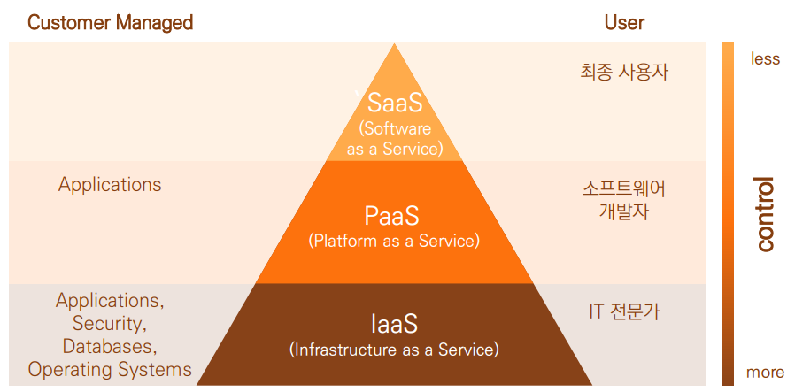
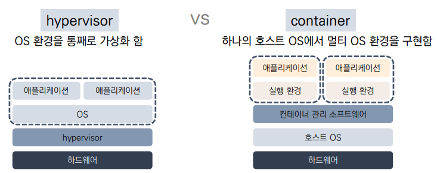

# 클라우드 모델

- 아래로 갈수록 유연하고, 위로 갈수록 속도가 높음

## IaaS - Infrastructure as a Service 
정의 : CPU나 하드웨어 등의 컴퓨팅 리소스(자원)를 네트워크를 통해 서비스로 제공하는 모델 
- 사용자 : IT 전문가가 활용
- 유형 : 애플리케이션, OS, 보안, 데이터베이스
- 물리적 리소스를 가상화 하여 유연한 Infrastructure을 제공 

### 가상화 유형

### 1. Hypervisor
- OS 환경을 통째로 가상화 함
- **장점**
    - 가상 서버마다 OS를 선택할 수 있음
    - 가상 서버들이 완전히 분리되어 있음
    
- **단점**
    - 가상 서버마다 OS가 필요하므로 하드웨어 리소스의 소비량이 많음
    - 가상 서버의 부팅에 시간이 걸림
### 2. Container
- 하나의 호스트 OS에서 멀티 OS 환경을 구현함
    
- **장점**
    - 하나의 호스트OS에서 여러개의OS를 동시에 이용할 수 있음
    - 다른 컨테이너로의 복제성과 이식성이 뛰어남
- **단점**
    - 운영체제의 커널을 공유하므로, 각 운영체제의 이미지는 각 운영체제에서만 실행 가능함
    - 하나의 호스트 OS를 공유하기 때문에 컨테이너 하나가 사이버 공격을 받으면 다른 컨테이너가 위험에 노출될 가능성이 있음
    
## PaaS - Platform as a Service 
정의 : 기업의 애플리케이션 실행 환경 및 애플리케이션 개발 환경을 서비스로써 제공하는 모델 
- 사용자 : 소프트웨어 개발자
- 유형 : 애플리케이션
- 애플리케이션 실행 환경이나 데이터베이스 등이 미리 구성되어 있기에 단기간에 애플리케이션을 개발하여 서비스를 제공
- 애플리케이션 개발, 실행, 관리 할 수 있게 하는 플랫폼을 제공
- SaaS의 개념을 개발 플랫폼에 확장한 방식
- 개발을 위한 플랫폼 구축 필요 없이 웹에서 쉽게 빌려 쓸 수 있는 모델
- 개발자는 개발에만 집중, 애플리케이션이 동작하는 주변 환경은 가져다 쓰는 구조
- 개발에서 배포까지 라이프사이클이 짧아 **DevOps 문화**를 적용하기 용이함
- Market Place에서 준비되어있는 서비스를 골라서 사용
- 연결된 서비스는 해당 Application환경 변수로 확인가능

### DevOps문화
소프트웨어 개발과 운영의 합성어. 소프트웨어 개발자와 정보기술 전문가간의 소통, 협업 및 통합을 강조. 개발 조직과 운영조직간의 상호 의존적 대응 -> 빠른 개발을 가능하게 함

### 마이크로 서비스
개발 단위를 작게 나눔. 주문 플랫폼 -> 배송, 사용자, 유저 관리등으로 나눔 -> 이들 각각을 또 쪼개는 것… -> 필요한 것을 이 나눈 것들 중에서 가져오는 일이 가능 
ex) 넷플릭스

## PaaS의 동작 원리
- IaaS 자원 위에 여러 인스턴스들의 유기적인 조합으로 PaaS 동작함
    - 물리서버에서 Hypervisor로 가상화 > VM 생성 > VM에 garden을 이용해 Container로 가상화 > 앱 실행
- Application이 실제 배포 시 PaaS의 구성요소 중 Diego cell에서의 모습
    - 배포 명령 실행 > Diego 컨테이너 생성(garden 아래 생성) > Application 코드 배치 > 적합한 Buildpack 찾기 > 컴파일 진행 > Droplet Archive (Application이 동작할 수 있는 부가 요소를 모두 갖춘 형태, 압축) > Blobstore(컨테이너를 배포할 수 있는 환경)에 저장 > Application Instance가 실행될 새로운 컨테이너 생성 요청 > release 스크립트 실행 > Application 동작
    
## PaaS의 종류 

### 1. 퍼블릭(public)
"서비스 제공업체가 구축한 서버 ,스토리지 등의 IT 인프라를 기업들이 사용료를 내고 이용하는 방식"
- amazon, google, cloudBees …
- 특징
    1) 비용 절감 : 하드웨어나 소프트웨어를 구매하지 않아도 되며, 사용한 서비스에 대해서만 지불
    2) 유지관리 하지 않음 : 서비스 공급자가 유지 관리
    3) 높은 안정성 : 광대한 서버 네트워크를 통해 실패를 방지함
    4) 무제한에 가까운 확장성 : 비즈니스 요구 사항을 만족시키도록 주문형 리소스 사용가능, 돈만 내면 확장해줌

### 2. 하이브리드(hybrid)
"Public 클라우드와 Private 클라우드를 동시에 제공하고 양쪽 장점만 선택해 사용 가능한 클라우드 서비스"
- 많이 활용하는 방식
- 특징
    1) 제어 : 조직이 중요한 데이터의 사설 인프라를 유지 관리 할 수 있음
    2) 유연성 : 필요할 때 공용 클라우드에서 추가 리소스를 활용할 수 있음
    3) 비용 효율성 : 공용 클라우드에 맞게 규모 조정 가능하여 필요할 때만 추가 컴퓨팅 기능에 대해 지불
    4) 용이성 : 워크로드를 점진적으로 마이그레이션 할 수 있으므로 부담없이 클라우드 전환 가능

### 3. 프라이빗(private)
"기업 자체적으로 데이터센터 안에 클라우드 환경을 구축해 사용하는 방식"
- 특징
    1) 유연성 향상 : 특정 비즈니스(내 사업체, 내 서비스 안에서) 요구 사항을 만족시키기 위해 클라우드 환경을 사용자 지정할 수 있음
    2) 보안 강화 : 다른 사용자(클라우드, 서버)와 리소스를 공유하지 않으므로, 제한과 보안 수준을 강화할 수 있음
    3) 높은 확장성 : 사설 클라우드에서 여전히 공용 클라우드의 확장성과 효율성을 제공할 수 있음

## SaaS - Software as a Service 
정의 : 주로 업무에서 사용하는 소프트웨어의 기능을 인터넷 등의 네트워크를 통해 필요한 만큼 서비스로 이용할 수 있도록 제공하는 형태
- 사용자 : 최종 사용자
- 유형
    1) 오피스·ERP·CRM 등 전통적인 SW 영역에서 발전하고 있는 기업용 기반 SaaS
    2) 제조·의료·금융 등 개별 산업의 생산성 향상과 부가가치 창출을 위한 산업융합용 특화SaaS
    3) 문서저장·협업 등 개인의 편리한 생활을 정보생활용 SaaS
- IaaS, PaaS 환경 위에서 Software 기능을 서비스로 제공함 > 필요한 만큼만 이용하고 요금을 지불
- 서비스를 계약하고, 사용자 계정이 준비되면 즉시 서비스 이용 가능
- 인터넷을 통해 접속 가능해, 어디서나 휴대용 단말기로 접속 가능
- 성숙된 SaaS는 Multi Tenant, Configuration, Scalability 모두 충족해야만 좋은 서비스다
- 레벨 존재
    1) level 1 : Ad Hoc/Custom 
        - 앱들을 사용자 개수에 맞게 만드는 경우(1:1) 
        - ASP와 유사한 형태 
        - 각 고객별로 별도의 어플리케이션 인스턴스를 제공 
    2) level 2 : configurable
        - 설정을 변경 가능, 커스텀이 가능, 고정적인 자원이 할당 -> 비효율
        - 고객별로 애플리케이션 인스턴스를 제공
        - 설정 기능에 의한 커스터마이징
    3) level 3 : Configurable, Multi-Tenancy
        - 하나의 앱을 동시다발적으로 사용가능한 Multi Tenancy가 가능
        - 효율적인 자원 관리, 유연한 자원 할당이 가능
        - 모든 고객을 하나의 인스턴스로 지원
        - 메타 데이터를 통해 커스터마이징
        - 레벨 2와 비교하여 효율적인 자원 관리가 가능
    4) level 4 : Scalable, Configurable, Multi-Tenancy
        - 부하분산 시스템 - 사용자별로, 인스턴트별로 다 유연하게 나누는 경우
        - 부하분산 시스템에서 모든 고객을 지원하는 가장 성숙한 모델, 어려움
        - 고객의 데이터를 분산 관리
        
- 기술적 특징
    - 환경 설정 (Configuration) 
        : 소스코드 레벨의 수정 없이 사용자의 요구사항을 수용 (사용자가 필요한 기능은 설정을 통해 지원)
    - 다중 사용자 지원 (Multi-Tenancy) 
        : 하나의 어플리케이션을 다수의 사용자(Tenant)가 공유하여 사용하는 다중 소유 아키텍처 지원
    - 확장성 (Scalability) 
        : 가용성 및 성능 지원을 위해 다수의 인스턴스를 생성하고 사용자의 데이터를 분산 관리하며, 가상화·분산병렬 처리 등을 통해 확장성있는 서비스를 제공 (많이 쓰는 사람한테 많이 제공해야한다)

- 특징
    - Application & Data : 사용자가 독점적으로 이용하는 어플리케이션과 데이터 제공
    - 보안 : 테넌트 별 보안 정책 적용
    - 가용성 : 테넌트 별 가용성 보장
    - 확장성 : 사용자의 요구에 따라 용량 확대 및 축소
    - 과금 : 사용량 측정 및 과금

